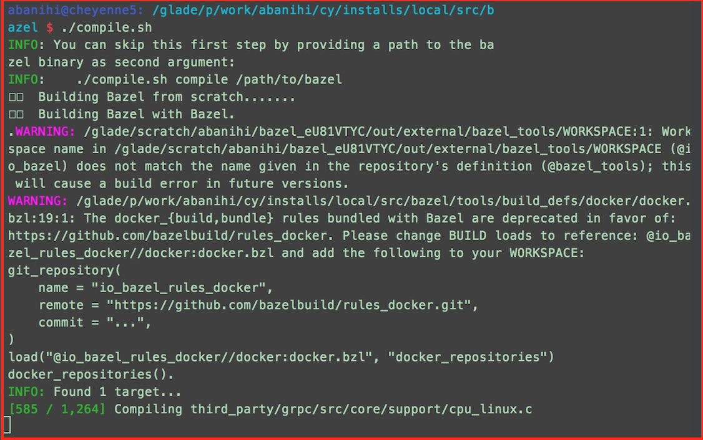
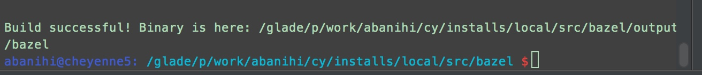
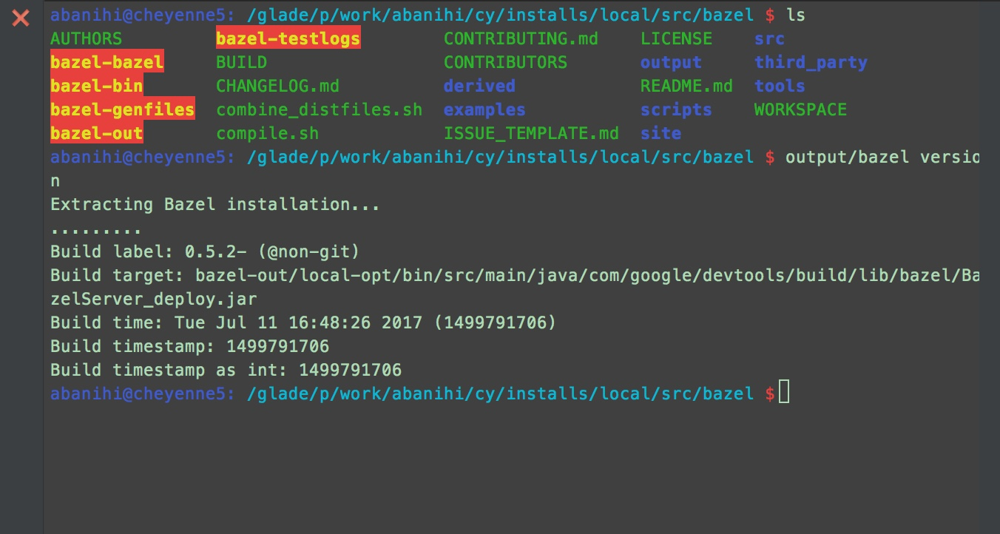

# 1. Build Bazel

First, to build Tensorflow a Bazel installation is required. Unfortunately, also the available Bazel binaries are not suitable for Cheyenne.. Thus, we need to start from the source:

# Trial 1: Failed

- ```wget``` distribution archive. Download bazel-<VERSION>-dist.zip from the release page (https://github.com/bazelbuild/bazel/releases) for the desired version.

- ```mkdir /glade/p/work/abanihi/cy/installs/local/src/bazel```

- move into this created directory

- ```wget https://github.com/bazelbuild/bazel/archive/0.5.2.tar.gz```

- ```tar -xvzf 0.5.2.tar.gz ```

- ```./compile.sh```

This is the error I get:
```sh
INFO: You can skip this first step by providing a path to the bazel binary as second argument:
INFO:    ./compile.sh compile /path/to/bazel
🍃  Building Bazel from scratch
ERROR: Must specify PROTOC if not bootstrapping from the distribution artifact

--------------------------------------------------------------------------------
NOTE: This failure is likely occuring if you are trying to bootstrap bazel from
a developer checkout. Those checkouts do not include the generated output of
the protoc compiler (as we prefer not to version generated files).

* To build a developer version of bazel, do

    bazel build //src:bazel

* To bootstrap your first bazel binary, please download a dist archive from our
  release page at https://github.com/bazelbuild/bazel/releases and run
  compile.sh on the unpacked archive.

The full install instructions to install a release version of bazel can be found
at https://docs.bazel.build/install-compile-source.html
For a rationale, why the bootstrap process is organized in this way, see
https://bazel.build/designs/2016/10/11/distribution-artifact.html
--------------------------------------------------------------------------------
```

- Abandon the downloaded ```tar.gz``` version

# Trial 2: Failed

- Get the zip distrubution archive with ```wget https://github.com/bazelbuild/bazel/archive/0.5.2.zip```

- ```unzip 0.5.2.zip```

- ```cd bazel-0.5.2```

- ```./compile.sh```
This is the error I get:
```sh
INFO: You can skip this first step by providing a path to the bazel binary as second argument:
INFO:    ./compile.sh compile /path/to/bazel
🍃  Building Bazel from scratch
ERROR: Must specify PROTOC if not bootstrapping from the distribution artifact

--------------------------------------------------------------------------------
NOTE: This failure is likely occuring if you are trying to bootstrap bazel from
a developer checkout. Those checkouts do not include the generated output of
the protoc compiler (as we prefer not to version generated files).

* To build a developer version of bazel, do

    bazel build //src:bazel

* To bootstrap your first bazel binary, please download a dist archive from our
  release page at https://github.com/bazelbuild/bazel/releases and run
  compile.sh on the unpacked archive.

The full install instructions to install a release version of bazel can be found
at https://docs.bazel.build/install-compile-source.html
For a rationale, why the bootstrap process is organized in this way, see
https://bazel.build/designs/2016/10/11/distribution-artifact.html
--------------------------------------------------------------------------------
```

# Trial 3: Failed

- ```git clone git@github.com:bazelbuild/bazel.git```


# Trial 4: Success

- ```wget https://github.com/bazelbuild/bazel/releases/download/0.5.2/bazel-0.5.2-dist.zip```
- ```unzip -d bazel bazel-0.5.2-dist.zip```
-  ```cd bazel```
- ```./compile.sh```: Get a drink or a Pop tarts because this takes a while


!!Succes


- Run ```output/bazel version```


# 2. Build Tensorflow

The Tensorflow documentation (https://www.tensorflow.org/install/#installing-from-sources) provides a good starting point for how to build Tensorflow from source:

**1. Checkout and configure it:**

```sh
$ git clone --recurse-submodules git@github.com:tensorflow/tensorflow.git
$ cd tensorflow
```

or 

```sh
$ git clone --recurse-submodules https://github.com/tensorflow/tensorflow
$ cd tensorflow
```

- Change line **165** in ```configure``` -> we need to update ```bazel version``` command since during the installation ```bazel``` didn't get added to our PATH. Bazel Binary is found in ```/glade/p/work/abanihi/cy/installs/local/src/bazel/output```

Our current directory should be ```/glade/p/work/abanihi/cy/installs/local/src/tensorflow```
- ```$ nano +165 configure```

**Original Content**:
```sh
bazel version > bazel.version
curr_bazel_version=$(head -n 1 bazel.version | cut -d ' ' -f3)
rm -f bazel.version
```

**Updated Content**:
```sh
../bazel/output/bazel version > bazel.version
curr_bazel_version=$(head -n 1 bazel.version | cut -d ' ' -f3)
rm -f bazel.version
```

Important configurations for Cheyenne:
cuDDN is located in ```/glade/u/apps/contrib/cudnn/``` (you may use it by doing 
```module use /glade/u/apps/contrib/modulefiles; ml cuDNN```)


## The Installation Failed. As of July 2017, Cheyenne doesn't ahve access to the GPUs (Caldera and Geyser)
## This document will be updated lated this year or next year :)